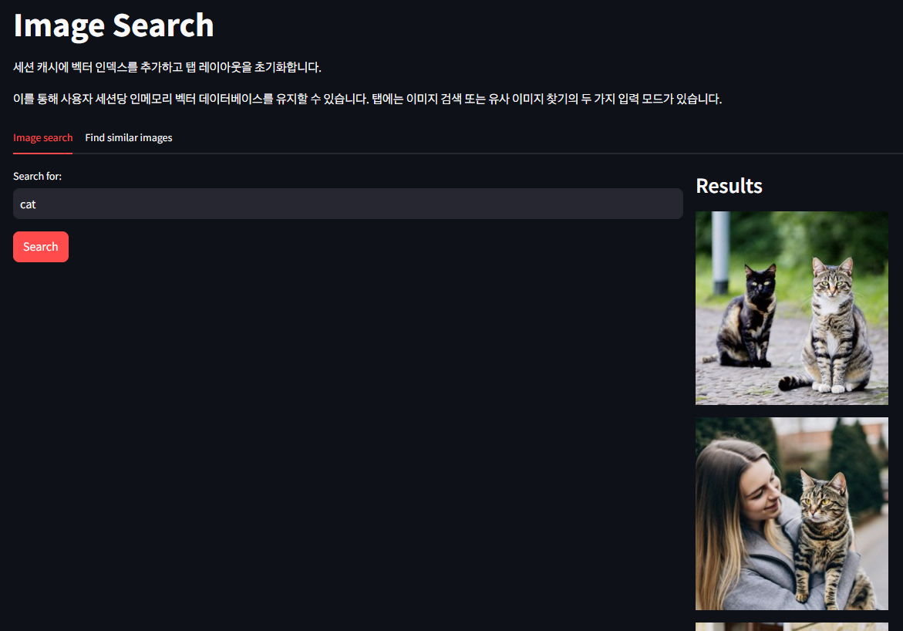

# 이미지 검색

`Titan Multimodal Embeddings`, `LangChain`, `Streamlit으로` 간단한 이미지 검색 애플리케이션

## 검색 가능한 이미지 색인 만들기

1. 로컬 디렉터리에서 각 이미지 파일 읽기
2. image bytes를 Titan Multimodal Embeddings에 전달하여 이미지의 숫자 표현(일명 vector 또는 embedding)을 얻음
3. embedding과 metadata(원본 이미지 파일의 경로 포함)를 인메모리 FAISS  데이터베이스에 저장

## FAISS 데이터베이스에서 이미지 검색

1. Amazon Titan Multimodal Embeddings를 사용하여 사용자의 검색 표현식 또는 업로드된 이미지를 숫자로 변환
2. FAISS 데이터베이스에서 가장 일치하는 이미지를 검색
3. 가장 일치하는 이미지를 반환하고 표시

## 사용 사례

- 이미지 컬렉션 검색
- 컬렉션에서 유사 / 동일한 이미지 찾기
- 기존 예시와의 유사성을 기준으로 이미지 분류

## 결과

